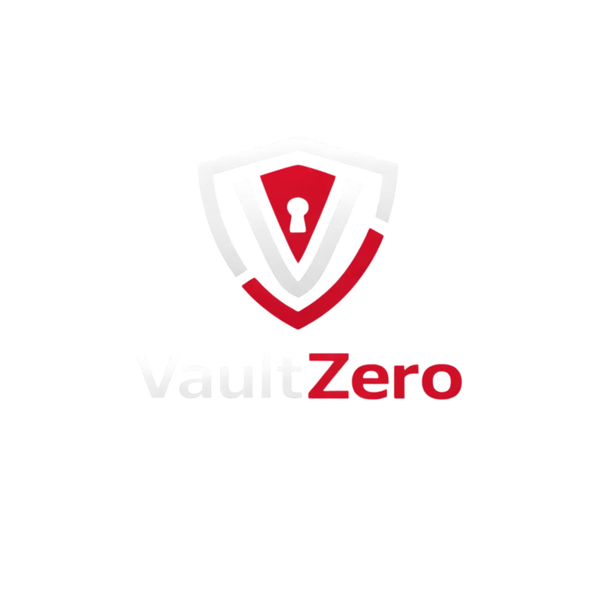

#  Security Policy

[](https://www.bestpractices.dev/projects/12040)

The VaultZero team takes the security of our application and the data it protects very seriously. We appreciate the efforts of the wider security community in helping us maintain a high standard of security.

## Supported Versions

Currently, the latest release on the `main` branch is supported for security updates. Please ensure you are running the most recent version of VaultZero before reporting vulnerabilities that may have already been patched.

| Version | Supported          |
| ------- | ------------------ |
| Latest  | :white_check_mark: |
| Older   | :x:                |

## Reporting a Vulnerability

If you discover a security vulnerability within VaultZero, please DO NOT disclose it publicly on the issue tracker. Doing so may put our users at risk before a patch can be developed and deployed.

Instead, please report the vulnerability privately via email:

**Email to Report Vulnerabilities:** `Vaultzero@tensorhub.pk`

### What to Include in Your Report

To help us triage and resolve the issue quickly, please include the following information in your report:

- **Type of vulnerability**: (e.g., XSS, Cryptographic flaw, logic bypass)
- **Steps to reproduce**: Detailed, step-by-step instructions or a proof-of-concept (PoC) to reproduce the issue.
- **Impact**: The potential impact of the vulnerability. The more details you provide, the better.
- **Environment details**: Browser version, OS, etc.

### Secure Communication

If you wish to communicate securely via PGP, please encrypt your report using our public key:

```text
[PLACEHOLDER_FOR_PGP_PUBLIC_KEY_BLOCK]
```

_(Note: Maintainers MUST manually generate and supply the PGP public key above.)_

### Response Process

1. **Acknowledgment**: We aim to acknowledge receipt of your vulnerability report within 48 hours.
2. **Triage**: We will investigate the issue and confirm its validity and impact.
3. **Remediation**: If valid, we will prioritize fixing the issue. We may communicate with you during this process to gather more details or test a patch.
4. **Disclosure**: Once a patch is released and users have had time to update, we may publish a security advisory detailing the vulnerability and the fix. We will mention your contribution if you agree to public credit.

Thank you for helping keep VaultZero secure!
